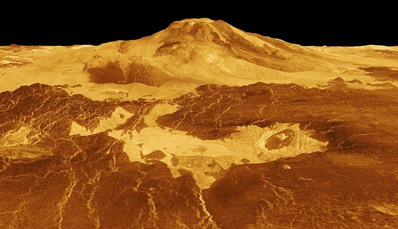

---
title: "Volcanoes On Venus"
---

```{r setup, include = FALSE}

knitr::opts_chunk$set(echo = FALSE)

```


---

Welcome to my Project __Volcanoes On Venus__.
\

---

```{r, fig.align='center'}



```


---

- In this project, I have analyzed the images of Volcanoes on Venus captured by NASA's Magellan spacecraft in 1990.
\

- __[Data Analysis](dataanalysis.html)__ page explains the analysis I carried out on the input data.
\

- __[Git Hub](https://github.com/manojmukkamala/VolcanoesOnVenus)__ page has the code and other documents used for analysis.
\

---

#### Background 

- The primary objectives of the Magellan mission were to map the surface of Venus with a synthetic aperture radar (SAR) and to determine the topographic relief of the planet. 
\

- At the completion of radar mapping 98% of the surface was imaged at resolutions better than 100 m, and many areas were imaged multiple times. 
\

- In the analysis of the data captured by the spacecraft they found volcanoes on the surface on Venus, volcanoes that can be used to make a automatic machine that can detect them.
\

---

#### Dataset 

The dataset is obtained at __[Kaggle](https://www.kaggle.com/fmena14/volcanoesvenus)__


